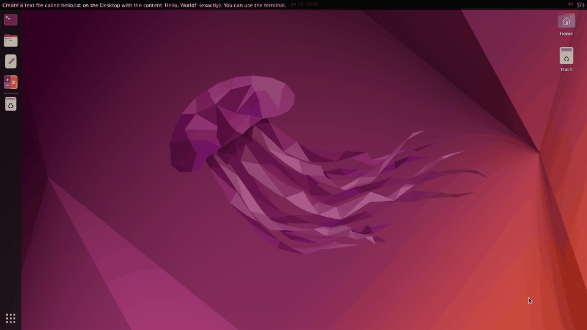
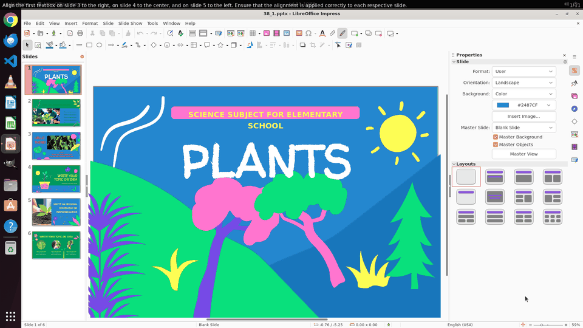
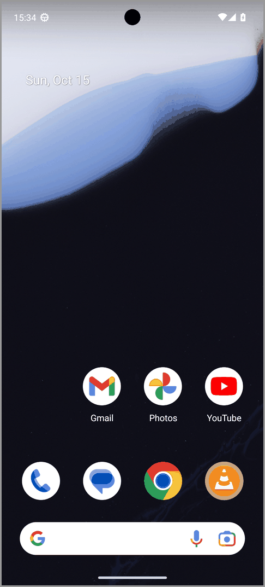
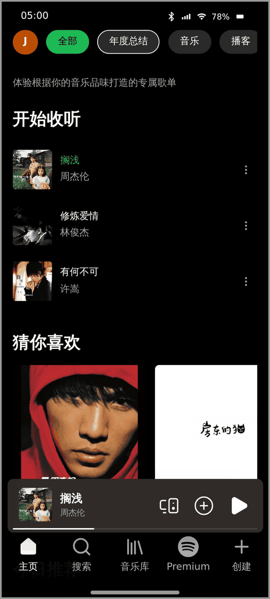

<h1 align="center">CUA-Lite</h1>

<p align="center">
Computer-Use Agents Made Simple
</p>

<p align="center">
  <a href="https://cua-lite.github.io">Homepage</a>
  &nbsp;·&nbsp;
  <a href="https://huggingface.co/cua-lite">Hugging Face</a>
  &nbsp;·&nbsp;
  <a href="https://cua-lite.github.io/#benchmarks">Leaderboard</a>
</p>

<p align="center">

</p>

## Features

CUA-Lite is a lightweight framework to standardize computer-use agents, sandboxes, data, evaluation, SFT, and RL across desktop, browser, and mobile — one schema, one interface, one command.

- **Any CUA.** 10+ built-in agents ([`lite/agents/models`](/lite/agents/models): GPT, Claude, Gemini, Qwen, UI-TARS, MAI-UI, ...) — or compose your own from the building blocks we ship ([`lite/agents/core`](/lite/agents/core)).
- **Any environment.** Unified action + observation spaces across **Desktop, Browser, and Mobile** — drop any agent into any env with near-zero overhead.
- **Efficient sandboxes.** KVM-free sandboxes with **30k+ verifiable tasks** to train and benchmark CUAs at scale.
- **Standardized SFT data format.** One schema ([`LiteSample`](/lite/core/samples.py)) for all data, shared across every env, agent, and [task type](/lite/data/preproc/AGENTS.md#dataset-task-types); per-agent adapters then postprocess it into each model's own scaffolding. From two sources:
  - **SFT data at scale.** [🤗 Corpora](https://huggingface.co/collections/cua-lite/corpora) — 10+ existing CUA datasets (grounding / understanding / use) preprocessed into the standardized format — ready to fine-tune any agent.
  - **SFT data on demand.** [🤗 Rollouts](https://huggingface.co/collections/cua-lite/rollouts) — roll out any teacher (e.g. GPT-5.5) into the *same* format and distill into any student; we ship the [pipeline](/docs/examples/rollout_to_hf.md) and the data — and keep rolling.
- **Eval any CUA on any benchmark.** One command evaluates any agent on any benchmark ([OSWorld](/lite/gym/envs/osworld/README.md), [OSWorld-2](/lite/gym/envs/osworld_2/README.md), [WindowsAgentArena](/lite/gym/envs/waa/README.md), [WebArena](/lite/gym/envs/browsergym/README.md), [WebVoyager](/lite/gym/envs/webharbor/webvoyager/README.md), [AndroidWorld](/lite/gym/envs/androidworld/README.md), [MobileWorld](/lite/gym/envs/mobileworld/README.md), ...). See 🏆 [Leaderboard](https://cua-lite.github.io/#benchmarks).
- **RL any CUA on any environment.** One command trains any agent with RL on highly optimized training tasks and environments ([CUAGym](/lite/gym/envs/lite/cuagym/README.md), [CUAWorld](/lite/gym/envs/lite/cuaworld/README.md), [WebGym](/lite/gym/envs/webgym/README.md), [MobileGym](/lite/gym/envs/mobilegym/README.md), …) — GRPO and beyond on top of Slime.

## Contents

- [Installation](#installation)
- [Quick Start](#quick-start)
- [Eval any CUA on any Benchmarks](#eval-any-cua-on-any-benchmarks)
- [SFT any CUA on any Datasets](#sft-any-cua-on-any-datasets)
- [RL any CUA on any Environments](#rl-any-cua-on-any-environments)
- [Documentation](#documentation)
- [Citation](#citation)

## Installation

```bash
uv sync --all-extras           # install deps for the quick start below
git submodule update --init    # optional — pulls the slime submodule, needed for training
```

See [environment setup](/docs/envs.md#installation) to install each environment separately.

## Quick Start

Sample a trajectory with a computer use agent:

```python
import asyncio
import lite.gym as gym
import lite.agents as agents

env = gym.make("lite.demo@create_file", max_steps=10)
agent = agents.make("gpt-5.5", env=env)
result = asyncio.run(agent.sample(env))
"""
result is a LiteRLSample:
    episode_return : float            — task reward (1.0 = success)
    terminated     : bool             — ended by agent / eval
    truncated      : bool             — hit max_steps
    steps          : list[LiteRLStep] — per-turn records
    lite_sample    : LiteSample       — messages + metadata + raw images
"""

# Any registered env / agent works — discover them with:
#   gym.registry.registered_env_ids()   # all makeable envs
#   gym.registry.task_ids(env_id)       # then an env's task ids
#   agents.registry.agent_ids()         # agents
# then compose "<env_id>@<task_id>", e.g.
# gym.make("lite.osworld@osworld_chrome_030eeff7")
# agents.make("Qwen/Qwen3-VL-8B-Instruct")
```

<details>
<summary><b>All agent ids and env ids</b></summary>

**Agent ids** (`agents.make(...)` / `--model-id`) — API families need a key; local ones are HF repo ids served through sglang/hf. Per-family surfaces and files: [`lite/agents/models`](/lite/agents/models).

> **GPT** `gpt-5.5` · `gpt-5.6-sol`
> **Claude** `claude-opus-4-8` · `claude-opus-4-7` · `claude-opus-4-6` · `claude-sonnet-4-6`
> **Gemini** `gemini-3.6-flash` · `gemini-3.5-flash` · `gemini-3.5-flash-lite`
> **Qwen3-VL** `Qwen/Qwen3-VL-{2B,4B,8B,32B}-{Instruct,Thinking}`
> **Qwen2.5-VL** `Qwen/Qwen2.5-VL-{3B,7B}-Instruct` &nbsp;·&nbsp; **Qwen3.5** `Qwen/Qwen3.5-{2B,4B,9B,27B}`
> **Qwen3.8** `Qwen/Qwen3.8-27B`
> **UI-TARS** `ByteDance-Seed/UI-TARS-7B-DPO` · `ByteDance-Seed/UI-TARS-1.5-7B`
> **Fara** `microsoft/Fara-7B` &nbsp;·&nbsp; **EvoCUA** `meituan/EvoCUA-8B-20260105`
> **MAI-UI** `Tongyi-MAI/MAI-UI-{2B,8B}` &nbsp;·&nbsp; **GELab** `stepfun-ai/GELab-Zero-4B-preview`

**Env ids** (`gym.make(...)` / `--env-id`) — compose a task as `"<env_id>@<task_id>"`. Each env's setup lives in its own README, linked from the benchmark and environment lists below.

> 🖱️ **ScreenSpot-Pro** `screenspot_pro` · **OSWorld-G** `osworld_g`
> 🖥️ **OSWorld** `osworld` · **OSWorld-2** `osworld_2` · **WindowsAgentArena** `waa` · **CUABench** `cua.bench.local.{basic,kicad,workflows}` · **Lite.OSWorld** `lite.osworld` · **Lite.CUAGym** `lite.cuagym` · **Lite.CUAWorld** `lite.cuaworld.<app>` · **Lite.ScaleCUA** `lite.scalecua` · **Lite.Demo** `lite.demo`
> 🌐 **WebArena** `browsergym.webarena` · **VisualWebArena** `browsergym.visualwebarena` · **MiniWoB** `browsergym.miniwob` · **WebVoyager** `webharbor.webvoyager` · **Online-Mind2Web** `online_mind2web` · **WebGym** `webgym` · **CAPTCHA** `captcha`
> 📱 **AndroidWorld** `androidworld` · **AndroidLab** `androidlab` · **MobileWorld** `mobileworld` · **MobileGym** `mobilegym`

`lite.cuaworld` expands per application (`lite.cuaworld.blender3d`, `.qgis`, `.vscode`, … 40 in total) — list them at runtime with `gym.registry.registered_env_ids()`.

</details>

See [`scripts/rollout.py`](/scripts/rollout.py) for the full example. Below: `gpt-5.5` on one
representative task per environment family.

```bash
uv run python scripts/rollout.py --model-id gpt-5.5 \
  --env-id lite.demo --task-id create_file --save-gif \
  --config-path scripts/configs/gpt/default/lite.demo.yaml

# See lite/gym/envs/lite/osworld/README.md for env setup
uv run python scripts/rollout.py --model-id gpt-5.5 \
  --env-id lite.osworld --task-id osworld_libreoffice_impress_05dd4c1d --save-gif \
  --config-path scripts/configs/gpt/default/lite.osworld.yaml

# See lite/gym/envs/browsergym/README.md for env setup
uv run python scripts/rollout.py --model-id gpt-5.5 \
  --env-id browsergym.webarena --task-id 21 --save-gif \
  --config-path scripts/configs/gpt/default/browsergym.webarena/default.yaml

# See lite/gym/envs/androidworld/README.md for env setup
uv run python scripts/rollout.py --model-id gpt-5.5 \
  --env-id androidworld --task-id ContactsAddContact --save-gif \
  --config-path scripts/configs/gpt/default/androidworld.yaml

# See lite/gym/envs/mobilegym/README.md for env setup
uv run python scripts/rollout.py --model-id gpt-5.5 \
  --env-id mobilegym --task-id spotify.PlaySongFromSearch --save-gif \
  --config-path scripts/configs/gpt/default/mobilegym.yaml
```

Each run saves its logs + `trajectory.mp4` / `trajectory.gif` under `.logs/rollout/<model_slug>/<env_id>/…/sample_NN/`:

<!-- Genesis-style: row 1 = GIFs, row 2 = env-id captions. Every GIF is sized by a
     fixed HEIGHT so all tiles are height-matched regardless of cell width — a
     percentage width would follow the auto-sized column (the longer "AndroidWorld"
     label widens its cell), rendering the portrait phones at different sizes. -->
<table>
<tr>
<td valign="middle" align="center"></td>
<td valign="middle" align="center"></td>
<td valign="middle" align="center"></td>
<td valign="middle" align="center"></td>
<td valign="middle" align="center"></td>
</tr>
<tr>
<td align="center"><a href="/lite/gym/envs/lite/demo/README.md"><b>Lite.Demo</b></a></td>
<td align="center"><a href="/lite/gym/envs/lite/osworld/README.md"><b>Lite.OSWorld</b></a></td>
<td align="center"><a href="/lite/gym/envs/browsergym/README.md"><b>WebArena</b></a></td>
<td align="center"><a href="/lite/gym/envs/androidworld/README.md"><b>AndroidWorld</b></a></td>
<td align="center"><a href="/lite/gym/envs/mobilegym/README.md"><b>MobileGym</b></a></td>
</tr>
</table>


## Eval any CUA on any Benchmarks

[Quick Start](#quick-start) ran a single task; to **benchmark** an agent, run a whole eval split with
`--splits eval` (+ `--concurrency`). Swap `--model-id` (and its matching
`--config-path`) for any agent, `--env-id` for any benchmark:

> For eval at high concurrency, we recommend running through an [env-server](/docs/envs.md#env-server).

```bash
# Grounding — ScreenSpot-Pro
# See lite/gym/envs/screenspot_pro/README.md for env setup
uv run python scripts/rollout.py --model-id Qwen/Qwen3-VL-8B-Instruct \
  --env-id screenspot_pro --splits eval --concurrency 256 \
  --config-path scripts/configs/qwen3_vl/default/screenspot_pro.yaml

# Desktop — Lite.OSWorld
# See lite/gym/envs/lite/osworld/README.md for env setup
uv run python scripts/rollout.py --model-id Qwen/Qwen3-VL-8B-Instruct \
  --env-id lite.osworld --splits eval --concurrency 8 \
  --filter "lambda m: not m.others.get('exclude_reason')" \
  --config-path scripts/configs/qwen3_vl/default/lite.osworld.yaml
```

Each run's aggregate score lands in `.logs/rollout/<model_slug>/<env_id>/…/summary.json`
(`stats.mean_episode_return`); tune `--concurrency` to the env (container/VM envs are
RAM/GPU-bound).

See [docs/eval.md](/docs/eval.md) for per-benchmark commands, setup, and options.

### Supported benchmarks (🏆 [Leaderboard](https://cua-lite.github.io/#benchmarks))

> - 🖱️ **Grounding** — [ScreenSpot-Pro](/lite/gym/envs/screenspot_pro/README.md), [OSWorld-G](/lite/gym/envs/osworld_g/README.md)
> - 🖥️ **Desktop** — [OSWorld](/lite/gym/envs/osworld/README.md), [OSWorld-2](/lite/gym/envs/osworld_2/README.md), [Lite.OSWorld](/lite/gym/envs/lite/osworld/README.md), [WindowsAgentArena](/lite/gym/envs/waa/README.md), [CUABench](/lite/gym/envs/cua/README.md)
> - 🌐 **Browser** — [WebVoyager](/lite/gym/envs/webharbor/webvoyager/README.md), [WebArena](/lite/gym/envs/browsergym/README.md), [VisualWebArena](/lite/gym/envs/browsergym/README.md), [MiniWoB](/lite/gym/envs/browsergym/README.md), [Online-Mind2Web](/lite/gym/envs/online_mind2web/README.md), [WebGym](/lite/gym/envs/webgym/README.md)
> - 📱 **Mobile** — [AndroidWorld](/lite/gym/envs/androidworld/README.md), [AndroidLab](/lite/gym/envs/androidlab/README.md), [MobileWorld](/lite/gym/envs/mobileworld/README.md), [MobileGym](/lite/gym/envs/mobilegym/README.md)

## SFT any CUA on any Datasets

Fine-tune any agent on the standardized SFT format.
Example: SFT Qwen3-VL-2B-Instruct on [🤗 Lite.ScaleCUA](https://huggingface.co/datasets/cua-lite/Lite.ScaleCUA) desktop trajectories
(rolled out by GPT-5.5). Export runs on the host; training in the
[Slime container](/docs/slime.md).

```bash
# --- host ---  (see README.md#installation for host setup)
export CUA_LITE_DATASETS_ROOT="$PWD/.data/huggingface"

# 1. download Lite.ScaleCUA to the canonical layout (--out = <root>/cua-lite/<Name>)
uv run python -m lite.data.hf.download Lite.ScaleCUA \
  --out "${CUA_LITE_DATASETS_ROOT}/cua-lite/Lite.ScaleCUA"

# 2. export a model-ready SFT parquet with the compact config — downsampled
#    resolution + history_n=1 to fit training VRAM (--image-root = dir ABOVE cua-lite/).
#    Keep successful rows, then downsample to 5000 (--filter applies first).
uv run python -m lite.train.export.export_sft \
  --config scripts/configs/qwen3_vl/compact/lite.osworld.yaml \
  --model-id Qwen/Qwen3-VL-2B-Instruct \
  --data-paths "${CUA_LITE_DATASETS_ROOT}/cua-lite/Lite.ScaleCUA" \
  --image-root "${CUA_LITE_DATASETS_ROOT}" \
  --filter "lambda m: (m.others.get('episode_return') or 0) > 0.5" \
  --sample 5000 --seed 42 \
  -o .data/sft/qwen3_vl/lite.scalecua/train.parquet

# --- Slime container ---  (see docs/slime.md for container setup)
# 3. SFT on 2 GPUs. TP defaults to 1 → DP=2 (raise TP_SIZE on OOM).
CUDA_VISIBLE_DEVICES=0,1 NUM_TRAIN_GPUS=2 \
  MODEL_ID=Qwen/Qwen3-VL-2B-Instruct \
  SAVE=1 NO_SAVE_OPTIM=1 NUM_EPOCH=2 GLOBAL_BATCH_SIZE=32 LR=5e-6 \
  PROMPT_DATA=/workspaces/cua-lite/.data/sft/qwen3_vl/lite.scalecua/train.parquet \
  SAVE_HF_DIR=/workspaces/cua-lite/.ckpts/qwen3_vl-2b/lite.scalecua/sft/iter_{rollout_id} \
  bash /workspaces/cua-lite/scripts/train/run_sft.sh
```

Then compare base vs. SFT as in [Eval](#eval-any-cua-on-any-benchmarks): point `--model-path`
at the checkpoint above and read `stats.mean_episode_return` — evaluating with the
*same* [`compact/lite.osworld.yaml`](/scripts/configs/qwen3_vl/compact/lite.osworld.yaml) it trained on
([`default/lite.osworld.yaml`](/scripts/configs/qwen3_vl/default/lite.osworld.yaml) is
full-resolution, when VRAM allows). In our run this lifts Qwen3-VL-2B from **0.138 → 0.237** on the `lite.osworld` eval split (332 valid tasks).
See [docs/sft.md](/docs/sft.md) for more examples.

### Supported datasets ([🤗 HF Hub](https://huggingface.co/cua-lite))

> - 📚 **[Corpora](https://huggingface.co/collections/cua-lite/corpora)** (preprocessed existing datasets) — [Aguvis](https://huggingface.co/datasets/cua-lite/Aguvis), [CAGUI](https://huggingface.co/datasets/cua-lite/CAGUI), [GUI-360](https://huggingface.co/datasets/cua-lite/GUI-360), [GUIAct](https://huggingface.co/datasets/cua-lite/GUIAct), [GUIOdyssey](https://huggingface.co/datasets/cua-lite/GUIOdyssey), [Multimodal-Mind2Web](https://huggingface.co/datasets/cua-lite/Multimodal-Mind2Web), [OpenCUA](https://huggingface.co/datasets/cua-lite/OpenCUA), [ScaleCUA](https://huggingface.co/datasets/cua-lite/ScaleCUA), [UI-Genie-Agent](https://huggingface.co/datasets/cua-lite/UI-Genie-Agent)
> - 🎬 **[Rollouts](https://huggingface.co/collections/cua-lite/rollouts)** (GPT-5.5 rollouts) — [Lite.OSWorld](https://huggingface.co/datasets/cua-lite/Lite.OSWorld), [Lite.ScaleCUA](https://huggingface.co/datasets/cua-lite/Lite.ScaleCUA), [Lite.CUAGym](https://huggingface.co/datasets/cua-lite/Lite.CUAGym), [Lite.CUAWorld](https://huggingface.co/datasets/cua-lite/Lite.CUAWorld), [WebGym](https://huggingface.co/datasets/cua-lite/WebGym)

## RL any CUA on any Environments

Reinforce any agent with GRPO across real
environments served concurrently through an [env-server](/docs/envs.md#env-server).
Example: GRPO Qwen3-VL-2B-Instruct on [MobileGym](/lite/gym/envs/mobilegym/README.md)
(416 mobile tasks across 28 apps). Task export runs on the host; rollouts + training
run in the [Slime container](/docs/slime.md) against the env-server.

```bash
# --- host ---  (see README.md#installation for host setup)
# 1. export MobileGym train / eval task splits (filter to L1–L2 difficulty)
uv run python -m lite.train.export.export_tasks --env-id mobilegym --split train \
  --filter "lambda m: m.others.get('difficulty') in ('L1', 'L2')" \
  -o .data/tasks/mobilegym/train.parquet
uv run python -m lite.train.export.export_tasks --env-id mobilegym --split eval \
  --filter "lambda m: m.others.get('difficulty') in ('L1', 'L2')" \
  -o .data/tasks/mobilegym/eval.parquet

# 2. start a MobileGym env-server for the rollouts to hit (see docs/envs.md#env-server)
#    (build the MobileGym env image first — see lite/gym/envs/mobilegym/README.md)
uv run python scripts/serve_env.py --port 30100 --env-ids mobilegym &
export CUA_LITE_ENV_SERVER_URL="http://$(hostname -I | awk '{print $1}'):30100"
export CUA_LITE_ENV_SERVER_TOKEN="$(whoami)"

# --- Slime container ---  (see docs/slime.md; the env-server vars are forwarded in)
# 3. GRPO on 2 GPUs (sync rollout + train colocated).
#    TP defaults to 1 -> DP=2; raise TP_SIZE on OOM.
CUDA_VISIBLE_DEVICES=0,1 NUM_TRAIN_GPUS=2 \
  MODEL_ID=Qwen/Qwen3-VL-2B-Instruct \
  ENV_ID=mobilegym \
  PROMPT_DATA=/workspaces/cua-lite/.data/tasks/mobilegym/train.parquet \
  EVAL_PROMPT_DATA=/workspaces/cua-lite/.data/tasks/mobilegym/eval.parquet \
  ROLLOUT_BATCH_SIZE=16 N_SAMPLES_PER_PROMPT=8 ENV_CONCURRENCY=64 \
  CONFIG_PATH=/workspaces/cua-lite/scripts/configs/qwen3_vl/compact/mobilegym.yaml \
  bash /workspaces/cua-lite/scripts/train/run_grpo.sh
```

<!-- 📈 [Training curves on W&B](https://wandb.ai/asap-zzhou/cua-lite/runs/02ynlddp): [rollout return](https://wandb.ai/asap-zzhou/cua-lite/runs/02ynlddp?nw=nwuserasapzzhou&panelDisplayName=rollout%2Fraw_reward&panelSectionName=rollout) and [held-out eval](https://wandb.ai/asap-zzhou/cua-lite/runs/02ynlddp?nw=nwuserasapzzhou&panelDisplayName=eval%2Fmobilegym_eval%2Freturn_mean&panelSectionName=eval) both climbing. -->

See [docs/grpo.md](/docs/grpo.md) for more — async train/rollout, other RL algorithms, other envs, and all hyperparameters.

### Supported environments

> 🖥️ [Lite.CUAGym](/lite/gym/envs/lite/cuagym/README.md), [Lite.CUAWorld](/lite/gym/envs/lite/cuaworld/README.md), [Lite.ScaleCUA](/lite/gym/envs/lite/scalecua/README.md), [Lite.OSWorld](/lite/gym/envs/lite/osworld/README.md) &nbsp;·&nbsp; 🌐 [WebGym](/lite/gym/envs/webgym/README.md) &nbsp;·&nbsp; 📱 [MobileGym](/lite/gym/envs/mobilegym/README.md)

## Documentation

| Doc | What's in it |
|:---|:---|
| [docs/envs.md](/docs/envs.md)   | available envs, API reference, action spaces |
| [docs/eval.md](/docs/eval.md)   | rollout scripts for benchmarking |
| [docs/slime.md](/docs/slime.md) | Docker training container setup |
| [docs/sft.md](/docs/sft.md)     | supervised fine-tuning |
| [docs/grpo.md](/docs/grpo.md)   | GRPO / RL training |

## Citation

```bibtex
@misc{cua-lite,
  author       = {Zhanhui Zhou and Weichen Zhang and Haoran Liu and Lingjie Chen and Tianneng Shi 
                  and Kevin Lin and Zhengyuan Yang and Lijuan Wang and Dawn Song},
  title        = {CUA-Lite: Computer-Use Agents Made Simple},
  year         = {2026},
  howpublished = {\url{https://github.com/cua-lite/cua-lite}},
  note         = {Accessed: 2026-08-24}
}
```

## Acknowledgments

We thank [Lambda](https://lambdalabs.com/) for providing part of the compute credits that supported this work.
